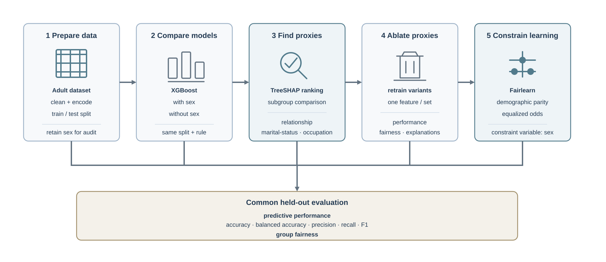
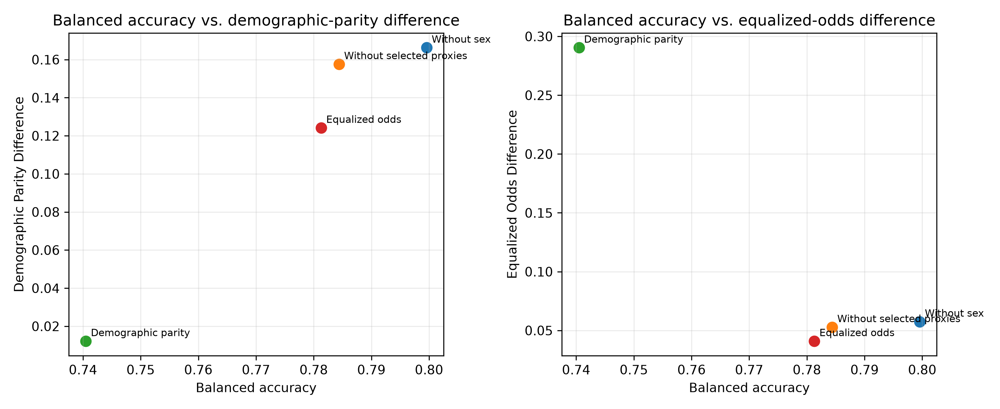

# Fairness Auditing of an Income-Classification Model

This repository contains the experiments and manuscript for **“Fairness
Auditing of an Income-Classification Model: SHAP-Based Analysis of Proxy
Features.”**
- Code: [./src](./src), [./scripts](./scripts)
- Data and output: [./data](./data)
- Report: [./report](./report)

The study asks whether removing an explicit sensitive feature (here `sex`) is
enough to make a model fair. The UCI Adult Income dataset's classification task is to predict whether annual income of a person exceeds `$50K`.

## Findings
- Removing `sex` did not help much (the model is still unfair just the same)
- Removing proxy-features: visible but minimal effect
- Fairness-constrained learning: successfully reduces either DPD or EOD, but not both at the same time >>> We need to define a single fairness metric.

## Audit workflow



The workflow uses a fixed official UCI Adult train/test split, fits
preprocessing on training data only, keeps `sex` available for evaluation, and
compares matched XGBoost models with feature-removal and Fairlearn
`ExponentiatedGradient` interventions.

## Key results

The values below are measured on the same held-out test split. Lower DPD and
EOD indicate smaller observed group disparities; higher balanced accuracy
(`BAcc`) and F1 indicate better predictive performance.

| Model | Accuracy | BAcc | F1 | DPD | EOD |
| --- | ---: | ---: | ---: | ---: | ---: |
| Without `sex` | 0.8748 | 0.7996 | 0.7125 | 0.1662 | 0.0575 |
| Without selected proxies | 0.8690 | 0.7844 | 0.6923 | 0.1576 | 0.0528 |
| Demographic parity constraint | 0.8513 | 0.7405 | 0.6276 | 0.0122 | 0.2904 |
| Equalized odds constraint | 0.8702 | 0.7813 | 0.6904 | 0.1241 | 0.0409 |

The trade-off is visible in the full comparison below: reducing one fairness
metric does not guarantee improvement in the other or preserve predictive
utility.



## Repository structure

- `data/adult/` - Local UCI Adult source files.
- `data/processed/` - Cleaned data and the fixed train/test partitions.
- `data/eda/` - Dataset summaries and exploratory figures.
- `data/models/` - Trained model artifacts, predictions, metrics, and result
  figures for each experiment.
- `src/trustworthy_ai/` - Reusable ETL, model, and evaluation utilities.
- `scripts/` - Executable pipeline stages for ETL, training, proxy analysis,
  comparison, and constrained learning.
- `report/neurips_2025.tex` - NeurIPS-style manuscript source.
- `report/neurips_2025.pdf` - Compiled manuscript.
- `PLAN.MD` - Project workflow and implementation log.

## Reproducing the experiments

The project uses the `trustworthy` conda environment described in `PLAN.MD`.
From the repository root:

```bash
conda create -n trustworthy python=3.14.7
conda activate trustworthy
python -m pip install -r requirements.txt
```

Run the pipeline stages in order:

```bash
python3 scripts/run_etl.py
python3 scripts/eda.py
python3 scripts/train_xgboost.py
python3 scripts/evaluate_baseline.py
python3 scripts/compare_sex_feature.py
python3 scripts/analyze_proxy_features.py
python3 scripts/constrain_learning.py
```

Each stage writes its outputs under `data/`, leaving the sensitive attribute
available for fairness evaluation even when it is excluded from predictive
features. The manuscript can be compiled from `report/` with the local LaTeX
toolchain.

## Scope and limitations

The proxy screen is associational: TreeSHAP measures model reliance and
feature--`sex` association measures statistical dependence; neither establishes
causality or discriminatory intent. The analysis uses a binary representation
of `sex`, does not analyze intersectional groups or threshold robustness, and
does not claim that demographic parity or equalized odds alone defines
fairness. Results are specific to this dataset, split, model family, and
evaluation design.
